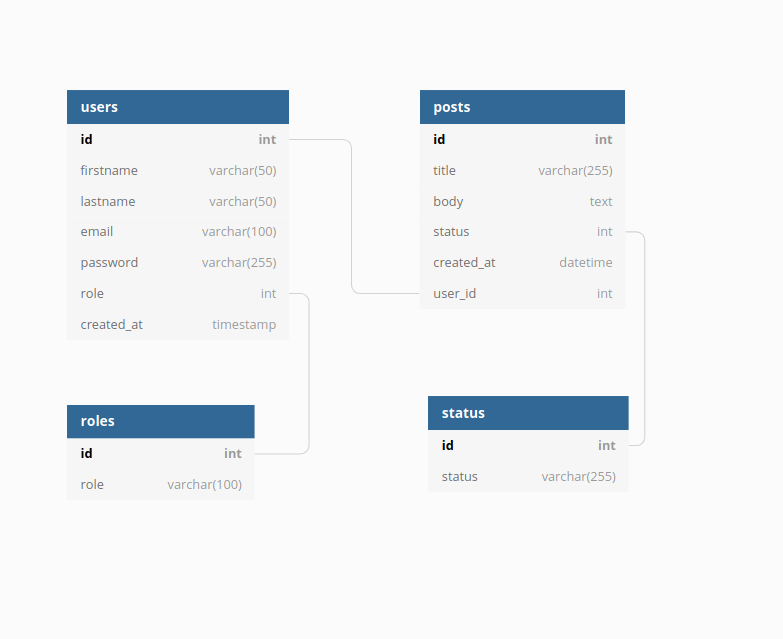

# BIT Sprint 3 - CMS

CMS built with laravel framework using TDD.

## Built with

* PHP > v.7.4.9
* Laravel > v.8.0.0

## Features / Requirements

* :heavy_check_mark: :x: CMS has home page with all posts
* :heavy_check_mark: :x: CMS has post page that contains individual post
* :heavy_check_mark: :x: CMS has admin login page
* :heavy_check_mark: :x: CMS has authorization
* :x: :x: CMS has admin dashboard
* :x: :x: CMS use  WYSIWYG editor for admin to publish new post
* :x: :x: Admin can create post
* :x: :x: Admin can change post status (published/draft)
* :x: :x: Admin can update post
* :x: :x: Admin can delete post
* :x: :x: Admin can create new user(writer)
* :x: :x: Writer can create his post
* :x: :x: Writer can update his post
* :x: :x: Writer can submit post for review to publish

## Database diagram

    

