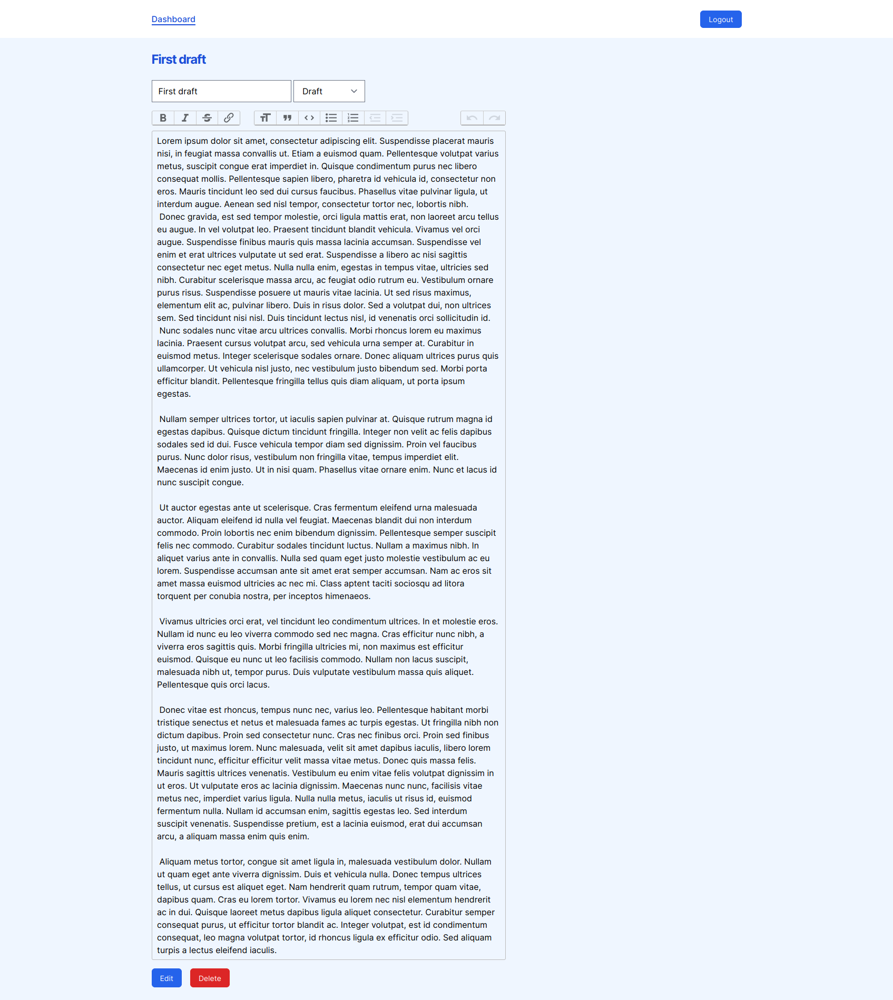

# BIT Sprint 3 - CMS

CMS built with laravel framework.

## Built with

* PHP > v.7.4.9
* Laravel > v.8.0.0

## Features / Requirements

* :heavy_check_mark: CMS has home page with all posts
* :heavy_check_mark: CMS has post page that contains individual post
* :heavy_check_mark: CMS has admin login page
* :heavy_check_mark: CMS has authorization
* :heavy_check_mark:  CMS has admin dashboard
* :heavy_check_mark:  CMS use  WYSIWYG editor for admin to publish new post
* :heavy_check_mark:  Admin can create post
* :heavy_check_mark:  Admin can change post status (published/draft)
* :heavy_check_mark:  Admin can update post
* :heavy_check_mark:  Admin can delete post

## Installation

Required:
    * PHP > v.7.4.9
    * Composer
    * Node

```bash
    # git clone 
    git clone git@github.com:EvaldasBurlingis/bit-sprint3-cms

    # change directory
    cd bit-sprint3-cms

    # copy .env
    cp .env.example .env

    # install composer packages
    composer update

    # install npm packages
    npm install

    # run migrations
    php artisan migrate

    # run seeders
    php artisan db:seed

    # start laravel server
    php artisan serve

    # login details
    # email: e@e.com
    # password: e

```

## Database diagram

<div>
    
</div>

## Screenshots

<div>
    <span>Homepage</span>
    
    </br>
    </br>
    <span>Posts page</span>
    
    </br>
    </br>
    <span>Post page</span>
    
    </br>
    </br>
    <span>Login page</span>
    
    </br>
    </br>
    <span>User dashboard page</span>
    
    </br>
    </br>
    <span>Create new post page</span>
    
    </br>
    </br>
    <span>Edit/delete post page</span>
    
</div>
